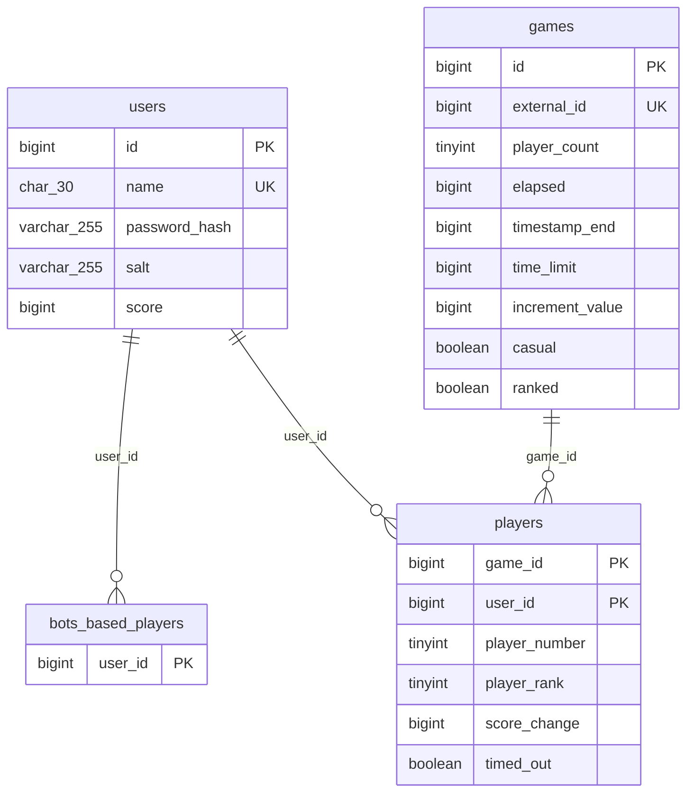

# Database

We use MySQL 8 for this project. Everything that defines the database lives under `db/`: the schema, seed data, and the Docker setup. When you bring the container up for the first time it runs the schema automatically, the seed is optional.

## Running the database

From the project root:

```bash
cd db && docker compose up -d
```

The first time you do this, the container creates the data volume and runs `db/schema.sql`. After that it just reuses whatever’s already there, it won’t re-apply the schema.

If you need to start completely fresh:

```bash
cd db && docker compose down -v
docker compose up -d
```

## Seed data

Docker doesn’t run the seed for you. When you want sample users, games, etc., run it manually:

```bash
mysql -h 127.0.0.1 -P 3306 -u root -ppolaris chinese_checkers < db/seed.sql
```

On Windows with PowerShell:

```powershell
Get-Content db/seed.sql | mysql -h 127.0.0.1 -P 3306 -u root -ppolaris chinese_checkers
```

The seed wipes `players`, `games`, `users`, and `bots_based_players` and then inserts the sample data.

## Connection

For local dev the app talks to MySQL at `localhost:3306`, database `chinese_checkers`, user `root`, password `polaris`.

## Schema overview

There are four tables. **users** holds both human and bot accounts (id, name, password_hash, salt, score; name is unique). **bots_based_players** is just a list of which user_ids are bots, FK to users with cascade delete. **games** is the main game record (id, external_id, player_count, timing stuff, casual/ranked flags; external_id is unique). **players** is the join table: which user is in which game, with player_number, player_rank, score_change, timed_out. Its primary key is (game_id, user_id), and it has FKs to both games and users, also with cascade. So if you delete a user or a game, the related rows in players (and in bots_based_players for that user) go away automatically.

Below is the same thing as a diagram and as DBML you can paste into dbdiagram.io or similar.

### Schema diagram (Mermaid)



### DBML (for dbdiagram.io or tooling)

```dbml
Table users {
  id bigint [pk, increment]
  name char(30) [not null, unique]
  password_hash varchar(255) [not null]
  salt varchar(255) [not null]
  score bigint [not null, default: 0]
}

Table bots_based_players {
  user_id bigint [pk, not null]
}

Table games {
  id bigint [pk, increment]
  external_id bigint [not null, unique]
  player_count tinyint [not null]
  elapsed bigint [not null, default: 0]
  timestamp_end bigint
  time_limit bigint [not null, default: 0]
  increment_value bigint [not null, default: 0]
  casual boolean [not null, default: false]
  ranked boolean [not null, default: false]
}

Table players {
  game_id bigint [not null]
  user_id bigint [not null]
  player_number tinyint [not null]
  player_rank tinyint
  score_change bigint [not null, default: 0]
  timed_out boolean [not null, default: false]

  indexes {
    (game_id, user_id) [pk]
  }
}

Ref: bots_based_players.user_id > users.id
Ref: players.game_id > games.id
Ref: players.user_id > users.id
```